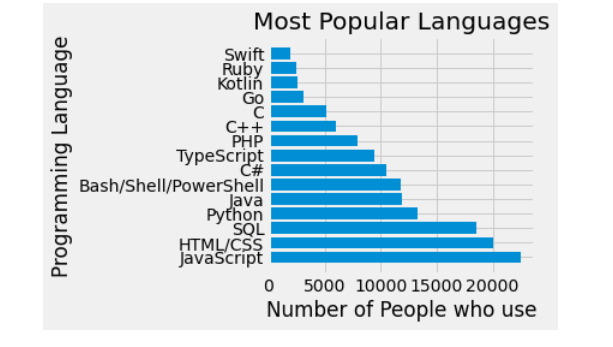
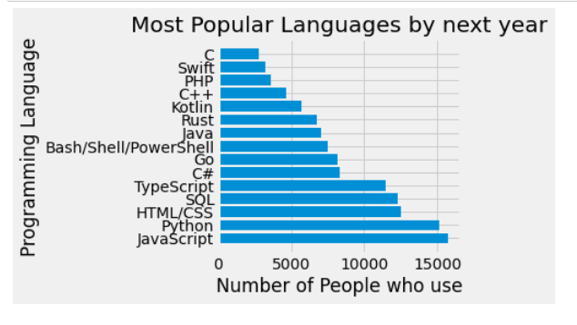

### Overview
This blog post is part of Udacity Project:1 (Write a Data Scientist Blog Post) under Data Scientists Nanodegree Program. Detailed analysis is done based on the project requirement, same is posted in my github repository executed on Jupyter notebook.

### Introduction
Whenever its about data visualization, its always confusing and requires lot of smart work. In this project i have tried to sort out some aspects based on dataset.
Here, I am using the Stack Overflow,2020 Dataset for this blog post, link for the same is mentioned in Reference section below. As part of the Stack Overflow,2020 initiatives, the dataset describes the IT professionals and other professional's future in different countires with different aspects. There are 64461 listings against 61 attributes in the dataset including full descriptions of listings and Payment structure. Due to very large dataset, I have dropped few columns, which were not useful during my data visualization part. 

Motivation behind this project:
If you want to analyse about yours future in terms of job growth, salary growth and Country which can be best for coding type of job, in that case, this project is best because it focuses on answering such questions only.

# Part I: Currently, As a Python Programmer, what scope do i have, and what scope its going to be in future?
 
In the listings there are 15 different Programming languages, which are in scope. Some of these Programming languages are very old whereas some are new, but got pace in IT market.

In the below Bar chart, you can see the comparison between No of languages and popularity for two different years. I would highlight the facts for top 5 languages, which are most popular.

**Currently, most popular Programming langauges among all Countries are:**
* JavaScript
* HTML/CSS
* SQL
* Python
* JAVA

**By next year, Programming langauegs vs Popularity**
* JavaScript
* Python
* HTML/CSS
* SQL
* TypeScript

As we can see here, how the popularity is changing of Programming langauges over a year. 
Pyhton is becoming second most popular language by next year, infact as per numbers, its very close to JavaScript. JAVA langauge is not even in the top5 list by next year.

So its always good to analyse such findings. 
 

Here you can see the comparison between both graph of Programming Languages vs Popularity

Based on above facts, we can calculate many intresting facts, like which Country can be best to work with, how much salary can i expect in future, am i going to be underpaid or overpaid employee. So we can find all these facts easily now based on above facts.

# Part II: Do you take yours job as hobby?
In the chart below, I was interested in, how many developers take their jobs as a hobby and what age group and gender they belong.  

There are some important features of listings. There are different aspects which attract the Professionals. Out of which *Languages, frameworks, and other technologies I’d be working with* aspect attracts more Profesionals, as they want to learn new things and keep themselves updated. 
Also we can see that young age group between 20-30years takes their job as a hobby compared to other age group.
Most of the Professionals are Male among the gender.
Here i am presenting one pairplot , rest plots can be seen in my github repository.

 

# Part III: What is the Job and Career Satisfaction difference?

Here, we can see that western programmers (blue ball) have a much higher satisfaction on their job and career, positioned at the right-high-up corner.
The ball size indicator their average salary, the blue ball size is much larger than the red ball (eastern programmers salary).

### Conclusion
In this article, we took a look at why switch your career to the western world if you live in the east according to Stack Overflow 2017 survey data.

1. We compared the salary based on Years a programmer has been coded between the eastern world and the western world. We found that the salary of an eastern programmer is much lower than that of the western no matter how many years they are coded.

2. We then looked at how different between the viewpoints that both west and east think if they are underpaid. This showed that more eastern programmers always think that they are underpaid than the western programmers no matter how many years they are coded.

3. Finally, we found that the Career and Job Satisfaction of the western programmers are much higher than those of the eastern programmers.

The findings here are observational, not the result of a formal study. So the real question remains:

> Will you go to the west?

To see more about this analysis, see the link to my Github available [here](https://github.com/rachit1010/rachit/blob/main/blog.md).
